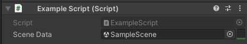
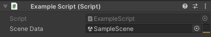
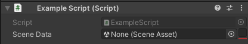
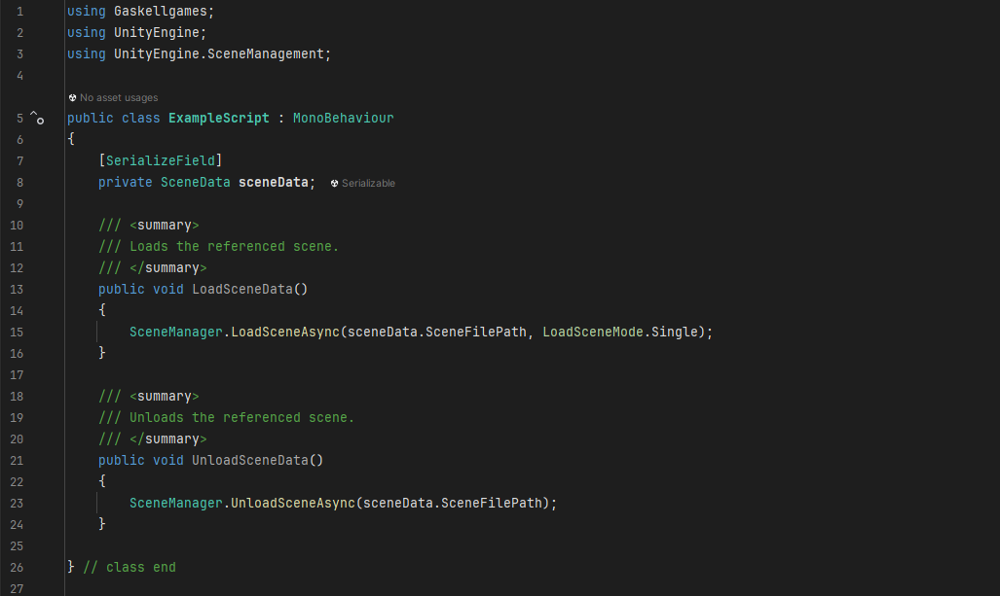

# Unity - SceneData

Custom scripts for Unity3D that esimplifies scene referencing at runtime and in the editor:

- SceneData uses a SceneAsset in the editor to cache the values of buildIndex, sceneName, sceneFilePath and guid.
- New SceneData can be created at runtime from: a scene, a buildIndex or a sceneFilePath.

# Inspector drawer:

- Toggle to show/hide the cached scene info.
- Coloured line to easily visualise if a scene is:

Green = in the build scenes and enabled:

Orange = not in the build scenes and enabled:

Red = Null:

# Simplifies script references:

